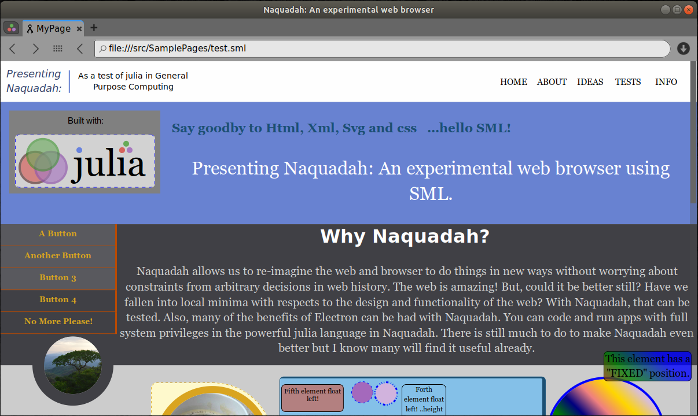

## Si te gusta este proyecto, [dale una estrella o descarga](https://github.com/TravisA9/NaquadahBrowser/tree/master/src)

---

## ¿Qué es Naquadah?

**Respuesta corta**: un navegador web experimental que consume **Scss**: código similar en lugar de **HTML/SVG/CSS**

#### ¿Por qué querríamos eso?

Aquí hay algunas observaciones en algunos idiomas:


|idioma|Estructurado|Expresivo|Terse|
|:---|:---|:---|:---|
|Html|Si|Si|No|
|Css|No|Si|No|
|Json|Si|Tan-tan|No|
|Scss|Si|Si|Si|

Una de las principales características experimentales de Naquadah es la consolidación de los muchos idiomas en solo uno. Esto debería reducir en gran medida la complejidad tanto del navegador como del diseño del sitio web/aplicación. También abre nuevas posibilidades para el navegador.


Echa un vistazo a una imagen más reciente:


## ¿Por qué deberías donar?
Un proyecto como este toma muchos cientos de horas para ponerse en marcha y miles de horas para pulir y mantener. Si nadie invierte el tiempo para desarrollar y probar nuevas ideas como esta, nadie se beneficiará de ellas. El tiempo que invierto en este proyecto bien podría dedicarse a otras actividades, pero si cree que vale la pena invertir en este proyecto, puede donar para que pueda dedicar más tiempo al desarrollo de NaquadahBrowser.

https://travisa9.github.io/NaquadahBrowser/

<form action="https://www.paypal.com/cgi-bin/webscr" method="post" target="_top">
<input type="hidden" name="cmd" value="_s-xclick" />
<input type="hidden" name="hosted_button_id" value="6EUBLKUKFAPU8" />
<input type="image" src="https://www.paypalobjects.com/en_US/MX/i/btn/btn_donateCC_LG.gif" border="0" name="submit" title="PayPal - The safer, easier way to pay online!" alt="Donate with PayPal button" />

</form>


### Una descripción más detallada de Naquadah:

Aunque, Naquadah se ve y funciona como un navegador web estándar, encontrará que hay algunas diferencias interesantes. Al igual que un navegador normal, Naquadah consiste principalmente en un **motor de diseño** y un **motor de renderizado** creados desde cero. Entonces, **no es un reenvasado de algún motor de navegador como webkit**.

* Naquadah utiliza **Cairo** para gráficos básicos y **GTK** para la GUI.

* Escrito en lenguaje de programación **julia**. Actualmente probado en julia v1.04 en linux. Las versiones anteriores han sido probadas en Windows.


#### Estado del proyecto

|Características de trabajo|
|: ---|
|**Etiquetas:** div, p, h1-h6, hr, a, pre, circle, page ('path' está actualmente en desarrollo)|
|**Estilos:** color, opacidad, degradados, tamaño, visualización, posición, borde, borde-radio, radio, relleno, margen, fuente, alineación y más.|
|**SML:** Clases, plantillas, etiquetas, variables|
|**Flotador:** Izquierda, Derecha|
|**Pantalla:** inline, inline-block, block, none|
|**Posición:** fija, absoluta, relativa|
|**Cuadro-Modal:** contenido, relleno, borde, margen|
|**Colores:** Cualquier color (con o sin opacidad)|
|**Eventos:**|
|**julia:** Los navegadores web usualmente ejecutan JavaScript. Este navegador ejecuta julia|
|**Recorte, selección de texto, degradados, desbordamiento**|
|**Shadow DOM:** Scrollbars (parcialmente funcional), controles de ventana|
|**Fondos:** color, degradado radial, degradado lineal, imagen\(con opacidad opcional)|


|Características en progreso|
|: ---|
|**Sombras:** Se está desarrollando un hack temporal para texto / actualmente se está desarrollando una implementación completa|
|**Enlaces**|


|Característica aún no implementada|
|: ---|
|**Transformaciones, Transiciones, Animaciones, Columnas, Consultas de medios, Máx / min, Tablas, Listas**|
|**Selectores:** \(.\), \ #, \[ \], $ =, \* =, &Gt;|


### En caso de que no te hayas dado cuenta, aquí hay algunas características interesantes de Naquadah:

* **Geometría como nodos:** El SVG se está mezclando cada vez más con Html. El objetivo aquí no es mezclar, sino integrar completamente las características de SVG en nuestro lenguaje markup. Hasta ahora, los círculos están configurados para funcionar como elementos de página normales, pero pronto se agregarán otras geometrías comunes.

* **Las pestañas, la barra de búsqueda, etc. son Shadow DOM:** Esto hace posible moverlas o incluso rediseñarlas por completo. Esto debería ayudar a garantizar que el navegador funcione con cualquier cambio en el motor gráfico e incluso cambiar la apariencia y la funcionalidad donde sea necesario (por ejemplo, dispositivos móviles).

* **Clases, variables y plantillas:** Las plantillas a menudo son deseables para definir la estructura (y sus estilos) que es repetitiva dentro de un sitio web. Esto se puede hacer en Sml, un lenguaje similar a Scss. Al declarar una clase en Sml, puede aplicar estilos a estructuras completas de elementos. También puedes crear variables con nombre y usarlas en tu sml.
* **julia:** Los navegadores web usualmente ejecutan JavaScript. Este navegador ejecuta julia.

---

# Introduciendo SML
Inicialmente, usé JSON en lugar de Html, Svg y Css como páginas web. Después de pensarlo mucho, me di cuenta de que una sintaxis similar a Scss sería mucho mejor. Es más fácil de leer y menos signos de puntuación como delimitadores. Es mucho más expresivo y se ve más limpio. Yo lo llamo Sml!

### Estructura general

Ejemplo de SML como página web

```scss
div{
    div{ color:white; padding:10;
        div{	display:inline-block; width: 108;
          font-color:0.21 0.26 0.41; font-size:18; font-style:oblique;
        text:"Presenting Naquadah:"}
        div{	display:inline-block; width: 200; padding:8 0 0 0; vertical-align:middle;
          border-width:2 0 0 0;border-color:0.41 0.51 0.82; border-style:solid;
          font-color:black; font-size:14; align:center
        text:"As a test of julia in General Purpose Computing"; }

        div{ class:MenuButton;	text:INFO}
        div{ class:MenuButton;	text:TESTS}
        div{ class:MenuButton;	text:IDEAS}
        div{ class:MenuButton;	text:ABOUT}
        div{ class:MenuButton;	text:HOME}
    }


```


**Los estilos** se pueden agregar directamente en los nodos, pero también puede crear clases y agregar el nombre de la clase a su elemento Sml. Lo interesante aquí es que las clases Sml pueden aplicar estilos a estructuras anidadas. En el ejemplo a continuación, puede ver que ```.round-button``` tiene estilos, pero contiene ```Circle``` que también tiene un estilo asignado. Ambos se aplican a sus respectivos elementos.

```scss
.botón-redondo{
    display:inline-block; margin:7; radius:12; color: 0.6 0.6 0.6
    hover{ color: 0.8 0.8 0.8; }
    circle{ radius:12; }
}

div{ height:39; color:0.6 0.6 0.6; padding:2;
    círculo {clase: botón-redondo; círculo {imagen: "Back.png"}}
    ...
    }

```


Los estilos son geniales, pero ¿qué sucede si desea insertar nuevos elementos o incluso secciones completas en su página web? Para eso tenemos **plantillas**! Supongamos que queremos hacer un pie de página para [Slashdot ...](https://slashdot.org).

```scss
 @SlashdotGreen: # 006666;

 @SlashdotFooter: footer {
    id: fhft;
    class: grid_24 nf;
    div {id: logo_nf; clase: fleft;
        a {href: "//slashdot.org"; span {Slashdot}}
    }
    nav {role: "pie de fuego"
        ul {id: controles-de-paginación;
        ...
}
    }
    ul {clase: "sustentar-historia"
        li {class: susto;
            a {href: "/submit"; span {class: opt; texto: Cuento; }}
        }
    }
}


```

Ahora podemos usar ```@SlashdotGreen``` como una variable asi: ```color: @SlashdotGreen;``` y de una manera similar podemos insertar automáticamente un pie de página Slashdot:
```scss
div {
   ...
   @SlashdotFooter;
}
```
## [Roadmap for Sml](src/DOM/SML.md)

# Cómo empezar

* Primero, instala [Julia](http://julialang.org/downloads/) si aún no lo has hecho.

* Para iniciar julia, ve a tu terminal y escribe: `julia`

* Clone NaquadahBrowser de esta manera:

`` `julia
  julia> Pkg.clone("https://github.com/TravisA9/NaquadahBrowser.git")
`` `

* Finalmente, una forma en que puedes iniciar la aplicación es con un comando REPL similar a este:

`` `julia
   julia> include("ruta/a/NaquadahBrowser.jl")
`` `
... o ejecute NaquadahBrowser.jl desde Juno u otro editor.

Nota: es posible que también tenga que instalar Xclip para copiar/pegar texto, simplemente ejecute algo como `sudo apt install xclip` si está ejecutando Linux.


# Código general

* [NaquadahCore](https://github.com/TravisA9/NaquadahBrowser/blob/master/src/Naquadah.md)
    - [DOM](https://github.com/TravisA9/NaquadahBrowser/blob/master/src/DOM/Readme.md)
    - [Eventos](https://github.com/TravisA9/NaquadahBrowser/blob/master/src/Events/Readme.md)
    - [Gráficos](https://github.com/TravisA9/NaquadahBrowser/blob/master/src/Graphics/Readme.md)
    - [Diseño](https://github.com/TravisA9/NaquadahBrowser/blob/master/src/Layout/Readme.md)


# Objetivos Generales

* Mantener la modularidad para que sea adaptable. Si en el futuro hay una buena razón para cambiar algo como la interfaz gráfica, debería ser fácil hacerlo sin tener que volver a trabajar todo el código. Además, si alguien quiere usar solo un módulo de Naquadah, debería ser fácil hacerlo.
* Hacer que Naquadah sea fácil de modificar y reutilizar. Naquadah se hace con la esperanza de ser útil. Puede modificarse para aplicaciones independientes, dispositivos móviles, editores de texto y más. Cuanto más se use, más se desarrollará.

# Lista de deseos:

* Editor de página integrado (tal vez WYSIWYG)
* Optimizar la velocidad
* Utilidades de animación de trazado y trazado\(Ej. Funcionalidad de diseño de fuerza \). Dado que Naquadah está destinado a ser un motor de diseño, puede ser bueno incluir más que solo las opciones básicas del navegador.
* Experimente conectándose de forma reactiva a bases de datos para actualizaciones de páginas en tiempo real.

### Echa un vistazo a la versión antigua.


travisashworth2007@gmail.com
