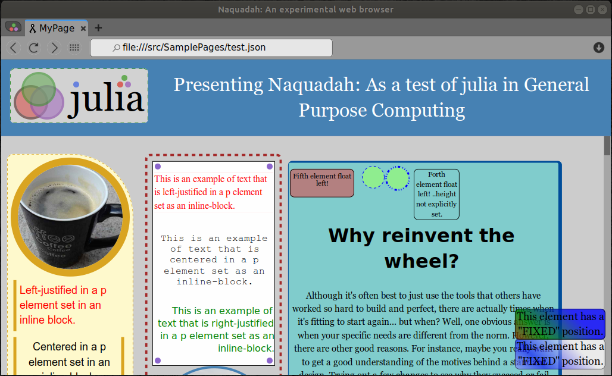

# Naquadah Browser

---

#### What is Naquadah?

**Short answer**: A browser and _layout engine_ that consumes <s>**Json**</s>  **Scss** instead of **HTML/CSS**

## Scss-like syntax update in progress :construction_worker:

Making web pages in JSON is working and has been great but after seeing the results it is clear we can still do better. This browser is a big experement and I think it is already proving to be worth the while. Json is great but with an Scss-like syntax we can benefit from a greater expressivness and readability of the code. That will mean less typing and better code highlighting features making the code prettier and easier to read. It will also mean fewer punctuation marks such as quotation marks and such.

Here are some observations on a few languages:

| language | Structured | Expressive | Terse |
| :--- |  :--- |  :--- |  :--- |
| Html |  |  |  |
| Css |  |  |  |
| Json |  |  |  |
| Scss |  |  |  |


Take a look:



**Longer answer**: Although, Naquadah looks and functions much like a standard web browser, you will find that there are a few interesting differences. Like a normal browser, Naquadah principally consists of a **layout engine** and a **render engine** built from the ground up. So it is not a repackaging of some browser engine such as webkit. For convenience, it includes a basic GUI as well.

* Naquadah uses **Cairo** for graphics and **GTK** for the GUI.

* Written in **julia** language as a test of its usability as a general purpose programming language. Currently tested in julia v0.7 in linux. Previous versions have been tested on Windows.

 It is being developed for fun and for the purpose of displaying my work but if it proves to be useful, that would be great too.

#### State of the project

| Feature :construction_worker:|  State of development |
| :--- |  :--- |
|  :white_check_mark: Tags |  div, p, h1-h6, hr, a, pre, circle, page ( 'path' is currently under development)|
|  :white_check_mark: Styles |  color, opacity, gradients, size, display, position, border, radius, padding, margin, font, alignment and more! |
|  :white_check_mark: Classes |  working (as a bonus: can be used as templates) |
| Floats :soon: |  Left is working but I need to finish Right \(I think\) |
|  :white_check_mark: Display |  inline, inline-block, block, none |
|  :white_check_mark: Position |  fixed, absolute, relative |
|  :white_check_mark: Box-Modal |  content, padding, border, margin |
|  :white_check_mark: Colors |  Any color (with or without opacity) |
| Events :soon: | Working  |
| :rocket: julia :rocket: | Web browsers usually execute JavaScript. This browser executes julia |
|  :white_check_mark: Clipping |  Mostly set up and working. |
| Text selection and highlighting :soon: |  Going well |
|  :white_check_mark: Gradients |  Mostly working |
|  :white_check_mark: Border Radius |  Working |
| Overflow :interrobang: |  Don't remember |
| Links :heavy_exclamation_mark: |  Nearly finished |
| Shadow DOM :soon: |  Scrollbars (partially working), window controls |
| Transforms/Transitions/Animations :heavy_exclamation_mark: |  Not yet started |
| Shadows :soon: |  Temporary hack for text/basically not yet begun |
|  :white_check_mark: Backgrounds |  color, radial-gradient, linear-gradient, image \(with optional opacity\) |
| Columns :heavy_exclamation_mark: |  Not yet started |
| Media queries :heavy_exclamation_mark: |  Not yet started |
| Selectors \(.\),   \#,   \[\],   $=,   \*=,   &gt;  :heavy_exclamation_mark: |  Not yet started |
| Max/min :heavy_exclamation_mark: |  Not yet available |
| Tables :heavy_exclamation_mark: |  Not yet |
| Lists :heavy_exclamation_mark: |  Not yet |


| Special Features | :mushroom: :octocat:    :pig2: :dash:|
| :--- |  :--- |
| Geometry as Nodes   :sparkles: |  So far circles are set up to work as normal page elements but other common geometries will soon be added. |
| Tabs and Search bar are Shadow DOM   :sparkles: |  This makes it possible to move or redesign them. This should help ensure that the browser works with any graphics engine changes and even change the appearance and functionality where needed \(Ex. mobile devices\). |
|  Classes/Styles as templates :sparkles: | Templates are often desirable to define structure that is repetitive within a web page/site. This can be done by declaring a class (which normally would only define styles) along with structural characteristics. That structure is now part of the class and gets added along with the associated styles. |
| :rocket: julia :rocket: | Web browsers usually execute JavaScript. This browser executes julia |

---

# General structure

Example of Json as a Web Page

```JSON
{
    "head":{ ... },
    "styles":{ ... },
    "body":[ ... ]
}
```

The **head** may look something like this.

```JSON
    "head":{
            "title":"MyPageTitle",
            "favicon":"http://myapp/favicon.ico",
            "charset":"utf-8",
            "keywords":"web tech, browser concept, Json Pages",
            "author":"Travis Deane Ashworth",
            "links":[
                {"url":"http://myapp/somescript.js"}
            ]
        }
```

The **styles** section stores frequently used styles \(similar to CSS\). However, since JSON can describe structure (_unlike CSS_), you can also use this section to define color swatches, templates and more, which automatically get applied :sparkles: to your page.

```JSON
    "styles":{

            "Button":{
                "onhover":{
                    "color":"steelblue"
                    },
                "color":"lightblue",
                "padding":5,
                "border":{
                    "radius":3,
                    "width":"thick",
                    "style":"solid",
                    "color":"blue"
                    },
                "font":{
                    "color":"white"
                    }
            },

            "ColoredBox":{
                style_data...
            }
        }
```

The **body** describes general structure \(similar to HTML and SVG\) and may also contain style information.

```JSON
    "body":[
            {">":"div",
                "class":"Button",
                "mousedown":"doSomething()",
                "text":"Some text"
            },
            {">":"circle",
                "onhover":"doSomethingElse()",
                "display":"inlineBlock",
                    "radius":25,        
                    "color":"lightgreen",
                "center":[25,25],
                "border":{"width":"thick",
                    "style":"solid",
                    "color":"blue"},
                "nodes":[...]
            }
    ]
```

As you can see there are three major sections to a Json page and these may be one file or spread across several files. It may be modified (in the future) by script as well.

# How To Get Started

* First, install [Julia](http://julialang.org/downloads/) if you haven't already done so.

* To start julia up go to your terminal and type: `julia`

* Clone NaquadahBrowser thusly:

```julia
  julia> Pkg.clone("https://github.com/TravisA9/NaquadahBrowser.git")
```

* Finally, one way you can start the application is with a REPL command similar to this:

```julia
   $ julia

   julia> include("NaquadahBrowser.jl")
```
...or run NaquadahBrowser.jl from Juno or another editor.

Note: you may also have to install Xclip for text copy/pasting just run something like `sudo apt install xclip` if you are running linux.

# Code overview

* [NaquadahCore](https://github.com/TravisA9/NaquadahBrowser/blob/master/src/Naquadah.md)
    - [DOM](https://github.com/TravisA9/NaquadahBrowser/blob/master/src/DOM/Readme.md)
    - [Events](https://github.com/TravisA9/NaquadahBrowser/blob/master/src/Events/Readme.md)
    - [Graphics](https://github.com/TravisA9/NaquadahBrowser/blob/master/src/Graphics/Readme.md)
    - [Layout](https://github.com/TravisA9/NaquadahBrowser/blob/master/src/Layout/Readme.md)


# General Goals

* Maintain modularity in order to be adaptable. If in the future there is good reason to switch out something such as the graphics interface, it should be easy to do so without reworking all the code. Also, if someone wants to use just one module out of Naquadah it should be easy to do so.
* ~~Maintain a measure of compatibility with~~ Learn from principal features of web standards.
* Make Naquadah easy to modify and re-purpose. Naquadah is made with the hopes of being useful. It may be modified for standalone apps, mobile devices, text editors and more. The more it is used, the more it will be developed.

# Wish List:

* sass-like syntax as a cleaner and more descriptive alternative to JSON
* Integrated page editor (perhaps WYSIWYG)
* Optimize speed
* Plotting and plot animation utilities \(Ex. force layout functionality\). Since Naquadah is meant to be a layout engine, it may be nice to include more than just the basic browser options.
* Experiment with reactively connecting to databases for real-time page updates.

##  Naquadah has now been overhauled!

In order to improve the general design and improve modularity I rewrote about 90% of the code. A lot of work you say? Yes, that is roughly 4,250 lines of code as I am writing this. That is in spite of the fact that I have made major simplifications to the code.

**More progress** has been made... As the lines of code increase so does the complexity but as I also continue to learn julia I see better ways of writing. I have simplified a lot of code and cleaned up quite a bit as well. As a result I have removed removed a great number of lines while still increasing functionality. I'm sure this will continue to happen and Naquadah will someday become a polished project ...I hope ;)

### Take a look at the old version


travisashworth2007@gmail.com
