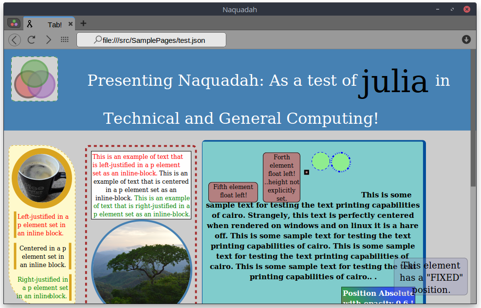

# Naquadah Browser

---

#### What is Naquadah?

**Short answer**: A browser and _layout engine_ that consumes **Json** instead of HTML

* Naquadah currently uses **Cairo** for graphics and **GTK** for the GUI.

* Written in **julia** language as a test of its usability as a general purpose programming language.



**Long answer**: Although, Naquadah looks and functions like a browser, there are a few differences. Naquadah principally consists of a **layout engine** and a **rendering engine** built from the ground up. For convenience, it includes a basic GUI as well.

 It is being developed for fun and for the purpose of displaying my work but if it proves to be useful, that would be great too.

#### State of the project

| Feature :construction_worker:|  State of development |
| :--- |  :--- |
|  :white_check_mark: Tags |  div, p, circle, page |
|  :white_check_mark: Styles |  color, opacity, gradients, size, display, position, border, radius, padding, margin, font, alignment and more! |
|  :white_check_mark: Classes |  Not yet finished |
| Floats :soon: |  Left is working but I need to finish Right \(I think\) |
|  :white_check_mark: Display |  inline, inline-block, block, none |
|  :white_check_mark: Position |  fixed, absolute, relative |
|  :white_check_mark: Box-Modal |  content, padding, border, margin |
|  :white_check_mark: Colors |  Any color with or without opacity |
| Events :soon: | Mostly working:  |
|  :white_check_mark: Clipping |  Mostly set up and working. |
| Text selection and highlighting :soon: |  Not yet started |
|  :white_check_mark: Gradients :white_check_mark: |  Mostly working |
|  :white_check_mark: Border Radius :white_check_mark: |  Working fine |
| Overflow :interrobang: |  Don't remember |
| Links :heavy_exclamation_mark: |  Not yet finished |
| Shadow DOM :soon: |  Scrollbars, window controls |
| Transforms/Transitions/Animations :heavy_exclamation_mark: |  Not yet started |
| Shadows :soon: |  Temporary hack for text/basically not yet begun |
|  :white_check_mark: Backgrounds |  color, radial-gradient, linear-gradient, image \(most all with optional opacity\) |
| Columns :heavy_exclamation_mark: |  Not yet started |
| Media queries :heavy_exclamation_mark: |  Not yet started |
| Selectors \(.\),   \#,   \[\],   $=,   \*=,   &gt;  :heavy_exclamation_mark: |  Not yet started |
| Max/min :heavy_exclamation_mark: |  Not yet available |
| Tables :heavy_exclamation_mark: |  Not yet |
| Lists :heavy_exclamation_mark: |  Not yet |


| Special Features | :construction_worker:   |
| :--- |  :--- |
| Geometry as Nodes   :sparkles: |  So far circles are set up to work as normal page elements but other common geometries will soon be added. |
| Tabs and Search bar are Shadow DOM   :sparkles: |  This makes it possible to move or redesign them. This should help ensure that the browser works with any graphics engine changes and even change the appearance and functionality where needed \(Ex. mobile devices\). |

---

# General structure

Example of Json as a Web Page

```JSON
{
    "head":{ ... },
    "styles":{ ... },
    "body":[ ... ]
}
```

The **head** may look something like this.

```JSON
    "head":{
            "title":"MyPageTitle",
            "favicon":"http://myapp/favicon.ico",
            "charset":"utf-8",
            "keywords":"web tech, browser concept, Json Pages",
            "author":"Travis Deane Ashworth",
            "links":[
                {"url":"http://myapp/somescript.js"}
            ]
        }
```

The **styles** section stores frequently used styles \(similar to CSS\). However, since JSON can describe structure (_unlike CSS_), you can also use this section to define color swatches, templates and more, which automatically get applied :sparkles: to your page.

```JSON
    "styles":{

            "Button":{
                "onhover":{
                    "color":"steelblue"
                    },
                "color":"lightblue",
                "padding":5,
                "border":{
                    "radius":3,
                    "width":"thick",
                    "style":"solid",
                    "color":"blue"
                    },
                "font":{
                    "color":"white"
                    }
            },

            "ColoredBox":{
                style_data...
            }
        }
```

The **body** describes general structure \(similar to HTML and SVG\) and may also contain style information.

```JSON
    "body":[
            {">":"div",
                "class":"Button",
                "mousedown":"doSomething()",
                "text":"Some text"
            },
            {">":"circle",
                "onhover":"doSomethingElse()",
                "display":"inlineBlock",
                    "radius":25,        
                    "color":"lightgreen",
                "center":[25,25],
                "border":{"width":"thick",
                    "style":"solid",
                    "color":"blue"},
                "nodes":[...]
            }
    ]
```

As you can see there are three major sections to a Json page and these may be one file or spread across several files. It may be modified (in the future) by script as well.

# How To Get Started

* First install [Julia](http://julialang.org/downloads/).

* To start julia up go to your terminal and type: `julia`

* Clone NaquadahBrowser thusly:

  ```julia
  julia> Pkg.clone("https://github.com/TravisA9/NaquadahBrowser.git")
```

* Finally, one way you can start the application is with a command similar to this:

  ```julia
   julia> include("path_to/.julia/v0.6/NaquadahBrowser/src/NaquadahCore.jl")
  ```

# General Goals

* Maintain modularity in order to be adaptable. If in the future there is good reason to switch out something such as the graphics interface, it should be easy to do so without reworking all the code. Also, if someone wants to use just one module out of Naquadah it should be easy to do so.
* Maintain a measure of compatibility with principal features of web standards. I believe that a lot of thought was put into the design and functionality of the WWW and that in general it is a good model to follow.
* Simplify as much as possible while increasing functionality. It is pointless to build another browser if it does not offer good features.
* Take advantage of opportunities to add select functionality that may not be feasible in an ordinary browser.
* Make Naquadah easy to modify and re-purpose. Naquadah is made to be used. It may be modified for standalone apps, mobile devices, text editors and more. The more it is used, the more it will be developed.
* Experiment with reactively connecting to databases for real-time page updates.

# Wish List:

* Generate proper images from blobs
* Integrated page editor \(perhaps WYSIWYG\)
* Optimize speed
* Compile distributable binaries for major OSs
* Plotting and plot animation utilities \(Ex. force layout functionality\). Since Naquadah is meant to be a layout engine, it may be nice to include more than just the basic browser options.


## \* Naquadah has now been overhualed!

In order to improve the general design and improve modularity I rewrote about 90% of the code. A lot of work you say? Yes, that is roughly 4250 lines of code as I am writing this. That is in spite of the fact that I have made major simplifications to the code.

### Take a look at the old version


travisashworth2007@gmail.com

ffmpeg -i /home/travis/Pictures/NaquadaMay2018.mp4 -r 10 -f image2pipe -vcodec ppm - | \
  convert -delay 5 -loop 0 - /home/travis/Pictures/NaquadaMay2018.gif
