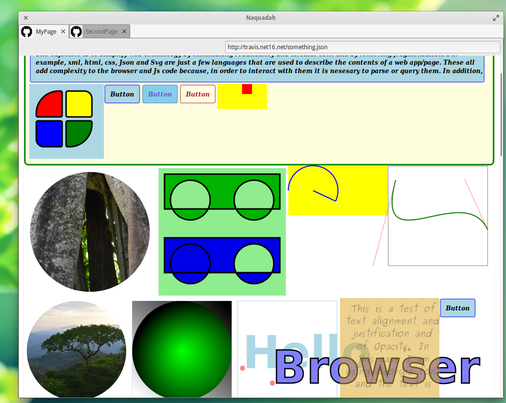
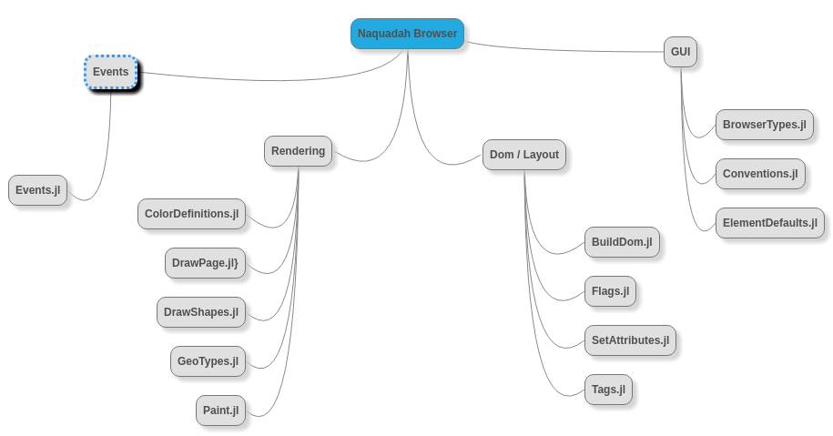

# Naquadah Browser

---

#### What is Naquadah?

**Short answer**: A browser and_ layout engine_ that consumes **Json** instead of HTML

> Naquadah currently uses **Cairo** for graphics and **GTK** for the GUI.

**Long answer**: Although, Naquadah looks and functions like a browser, there are a few differences. Naquadah principally consists of a **layout engine** and a **rendering engine** built from the ground up. For convenience, it includes a basic GUI as well. It is writen in the awesome **Julia language** and serves as a test of julia's value as a general purpose language. It is being developed for fun and for the purpose of displaying my work but if it proves to be useful, that would be great too.

Naquadah will eventually be divided into **modules** for seperation of concerns, to make them usable as stand-alone packages and to facilitate swapping out parts in the future if desired.




# State of the project

**Working...**

* **Tags**: Nodes can be created with the default settings of common Tags pluss an extended set. Many of the defaults still need set but otherwize it seems to be working.
* **Styles**: Attributes can be assigned to nodes as styles.
* **Classes**: One or more classes can be defined and assigned to nodes to change or add attribues.
* **Floats**: Left, Right
* **Display**: inline, block, inline-block
* **Position**: absolute, relative, fixed
* **Box-Modal**: content, padding, border, margin, height, width
* **Colors**: Background, border, text, Text-highlight, node-alpha, RGB\/RGBA
* **Circles**: The "circle" Tag can be used to create a cicle that is treated as any other node.
* **Events**: Hover and click events ahave been partially implemented.
* **Clipping**: works
* **Text-Highlighting**: 
* **Gradients**: radial, linear
* **Border-radiaus**:
* **Overflow**: scroll\(in progress\), hidden
* **Links**: open in new page for now.

**In progress...**

* **Geometry as nodes**: Lines, curves, arcs, paths, text-paths
* **Events**: drag, swipe, etc.
* **Transforms**:
* **Shaddow DOM**: scrollers, etc.

**Not yet started...**

* **Transitions**: 
* **Animations**:
* **JavaScript engine**: Maybe the v8 engine, would node be as good or better? ...don't know!
* **Consume other scripts**: Html, SVG, CSS...
* **Browsing History**:
* **Shadows**: text, box
* **Backgrounds**: images
* **Columns**:
* **Media Queries**:
* **Media**: Video, audio
* **Border Images**: ...maybe
* **Forms**: maybe
* **Selectors**: \(.\),   \#,   \[\],   $=,   \*=,   &gt;
* **Max\/min**: max-width, max-height, min-width, min-height
* **Tables**:
* **Lists**:
* **Outline**: ...maybe

---

# General structure

Example of a Web Page as Json

```JSON
{
    "head":{...},
    "styles":{...},
    "body":[...]
}    
```

The **head** may look something like this.

```JSON
    "head":{
            "title":"MyPageTitle",
            "favicon":"http://myapp/favicon.ico",
               "charset":"utf-8",
               "keywords":"web tech,browser concept,Json Pages",
               "author":"Travis Deane Ashworth",
              "links":[{"url":"http://myapp/somescript.js"}]
        }
```

The **styles** section stores frequently used styles \(similer to CSS\).

```JSON
    "styles":{
            "Button":{styles...},
            "ColoredBox":{styles...}
        }
```

The **body** describes general structure \(similer to HTML and SVG\) and may also contain style information.

```JSON
    "body":[
            {">":"div", 
                "class":"Button", 
                "mousedown":"doSomething()",
                "text":"Some text"
            },
            {">":"circle",
                "onhover":"doSomethingElse()",
                "display":"inlineBlock", 
                    "radius":25,        
                    "color":"lightgreen",
                "center":[25,25],
                "border":{"width":"thick", 
                    "style":"solid", 
                    "color":"blue"},
                "nodes":[...]
            }
    ]
```

As you can see there are three major sections to a Json page and these may be one file or spread across several files. It may be modified by script as well.

# How To Get Started

* First install [Julia](http://julialang.org/downloads/). To start julia up go to your terminal and type:

  ```
  $  julia
  ```

* Clone NaquadahBrowser thusly:

  ```julia
  julia> Pkg.clone("https://github.com/TravisA9/NaquadahBrowser.git") 
  ```

* You may also have to add package **dependancies** for this project. You can paste the following into the Julia Console and press enter.

  ```julia
  Pkg.add("Gtk")
  Pkg.add("JSON")
  Pkg.add("Cairo")
  Pkg.add("Requests")
  Pkg.add("Graphics")
  Pkg.add("ImageMagick")
  Pkg.add("Images") 
  ```

* Finally, you can start the application with the following command:


```julia
julia> using NaquadahBrowser 
```

If you close the window you can restart it like this:

```julia
julia> Start()
```

# General Goals

* Mantain modularity in order to be adaptable. If in the future there is good reason to switch out something such as the graphics interface, it should be easy to do so without reworking all the code. Also, if someone wants to use just one module out of Naquadah it should be easy to do so.

* Mantain a measure of compatability with principal features of web standards. I believe that a lot of thought was put into the design and functionality of the WWW and that in general it is a good model to follow.

* Simplify as much as possible while increasing functionality. It is pointless to build another browser if it does not offer good fetures.

* Take advantage of opertunities to add select functionality that may not be feasable in an ordinary browser.

* Make Naquadah easy to modify and repurpose. Naquadah is made to be used. It may be modified for standalone apps, mobile devices, text editors and more. The more it is used, the more it will be developed.

* Experiment with reactively connecting to databases for real-time page updates.


# Wish List:

Toss in HTML, SVG and CSS parsers to make the browser work with standard web pages.

Integrate v8 engine

Generate proper images from blobs

Integrated page editor \(perhaps WYSIWYG\)

Optimize speed

Compile distributable binaries for major OSs

Ploting and plot animation utilities. Example: force layout functionality

# Project Overview

This will continue to evolve...



travisashworth2007@gmail.com

